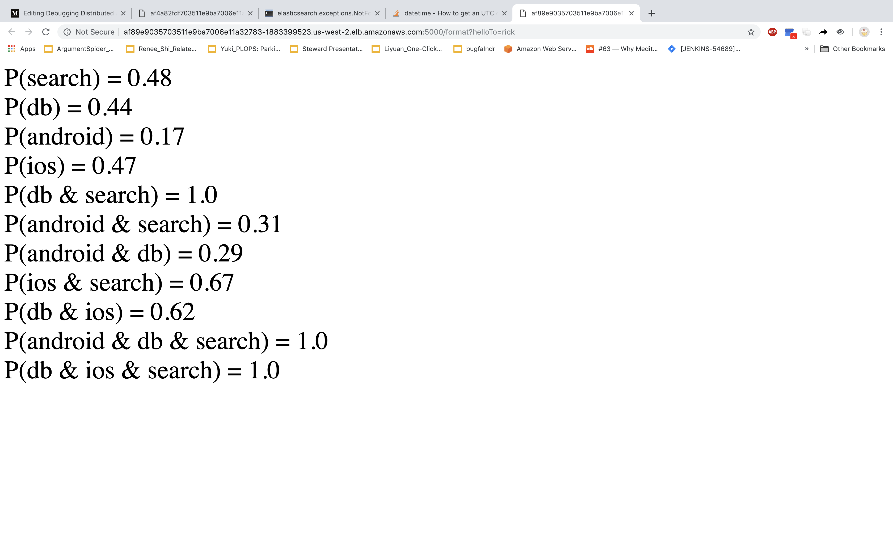

# Bugfinder
Bugfinder is a Kubernetes application that analyzes traces produced by Jaeger, and reports which services and combinations of services are likely to cause a Kubernetes application to respond slowly. Here is an example of the Bugfinder frontend.

   <figcaption>Fig 1: Bugfinder is reporting a 48% chance that the application will run slowly if the 'search' service is included in fulfilling the user's request. Note that if 'android' and 'search' microservices are involved in fulfilling the users request, there will be a 100% chance that the application responds slowly. </figcaption>

## Motivation and Explanation 
Microservice applications can be difficult to debug. A growing number of organizations combat this problem by instrumenting their applications with distributed tracing tools like 'Jaeger' or 'Zipkin'. Analyzing those traces can provide insight into why your application is running slowly, ultimately easing debugging pains. 

Typically, one pays money to a service like New Relic or RookOut to analyze those traces. BugFinder is a free alternative to those services. (BugFinder provides significantly less functionality. BugFinder can also be understood as exercise that provides exposure to the analysis that these SaaS platforms provide.)

This repo does 3 main things:

1. Launches a Kubernetes cluster on AWS using Kops
2. Deploys a Jaeger-operator, Jaeger, Elasticsearch, and BugFinder to the K8s cluster
3. Launches a 6-microservice testbed application

The testbed application suffers from a bug which is difficult to diagnose with conventional logging methods, but is trivial to resolve with Distributed Tracing. The application is instrumented, and BugFinder locates the bug with ease.

 
## Bugfinder in Action

To see Bugfinder in action, visit my [blog](https://medium.com/debugging-distributed-applications/debugging-distributed-applications-b6856122727e).

This code base is not meant to be run by the general public, because access to my dockerhub account is required. If you want to build and run this app, it is possible but will take some work. The instructions are below.

## Directories

### archive/
- old directories.
- My journal of things I tried

### awsenv/ 
- python virtual environment

### jaeger/
- launch jaeger into kubernetes

### launch/
- start up a cluster, initialized with kubernetes
- this folder probably won't work for you. On your own, you will need to figure out how to get a configured kubectl connected to a cluster.

### readmePics/
- readme pictures

### sweat/
- launch my testbed application
- launch bugfinder
- contains .yamls for all the services that run on kubernetes as part of this application
- contains scripts to deploy those .yamls
- contains source code to generate docker images for those services

## Instructions to Build and Run 

#### Build your Dockerhub images, modify repo to use them

The testbed application requires 6 docker images to run, and Bugfinder itself requires a Dockerimage. All of these images are built on top of a custom 'Base' image that you must also build. To reproduce this example on your machine, you must create all 8 of these images, and save them in your dockerhub account.

1. modify sweat/dockeruser to contain your dockerhub user name. Make sure there is only one line in this file, and that there are no space or tab characters. 
2. build your images by running `hub base`, `hub android`, `hub ios`, `hub search`, `hub model`, `hub db`, `hub db2`, and `hub bf`.
3. modify 7 .yaml files to include your dockerhub, instead of mine. The .yamls are all in sweat/deploy. They are called: android.yaml, ios.yaml, search.yaml, model.yaml, db.yaml, db2.yaml, and bf.yaml. 

#### Launch the testbed application, Jaeger, ElasticSearch, and BugFinder

Some addresses are given relative to the root of the repo, but sometimes, you have to navigate to the correct folder in the repo. Sorry.

To launch Jaeger and Elasticsearch, from root run:
	
	sh jaeger/commands.sh
	
To launch Bugfinder and the application, navigate to sweat/deploy/, and run 

	sh commands.sh
	
Now everything is up and running! If you would like to update the application as it is running, first modify the code base (if you wanted to change the 'android' microservice, you can open sweat/android/formatter.py, and make your change. If you wanted to change the 'model' microservice, you can open sweat/model/formatter.py) To push the change to dockerhub navigate to sweat/ and run `hub android`, and to pull it into the cluster, navigate to sweat/ and run `kub android`. 

An Exception: If you want to change the 'search' service (which you probably want to), you first modify sweat/search/formatter.py. And then you navigate to sweat/ and run `hub search` (as you did for the other services) But now run `kubsearch`. 'kubsearch' is a special script designed to handle this one service. (if you run `kub search`, you will replace the Elasticsearch pod)
	

